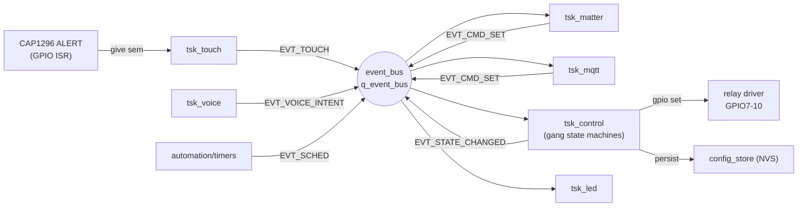
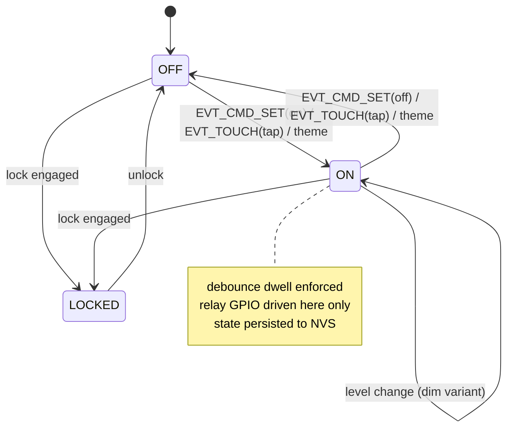
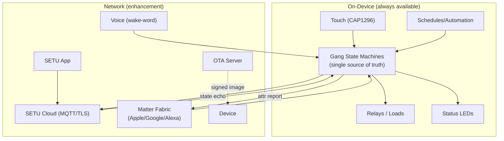

# SETU — Firmware Architecture

*Premium IoT Smart Switch Board | Embedded Software Architecture & Module Design*
*Version: 0.1 Draft | Date: June 2026 | Status: Pre-Implementation | Target: ESP-IDF v5.x*

---

## 0. Document Scope

This document is the **single source of truth for SETU firmware**. It defines the
runtime architecture, the RTOS task graph, every driver and middleware module, the
connectivity stack (WiFi / Matter / cloud), the voice + theme engine, the OTA and
security design, persistence, fault handling, memory budget, the build/partition
layout, and the test strategy. It maps directly onto the directory skeleton already
committed under `firmware/` and onto the ESP32-S3 pin allocation in
`SETU_Hardware_Implementation_Draft.md`.

> **Companion documents:**
> - Hardware: [SETU_Hardware_Implementation_Draft.md](SETU_Hardware_Implementation_Draft.md) — pin map, power rails, touch/relay electrical design
> - OTA detail: `SETU_OTA_Update_Protocol.md` (separate doc — signing, rollback, partition scheme)
> - Roadmap: [SETU_24M_Execution_Roadmap.md](SETU_24M_Execution_Roadmap.md) — firmware phase deliverables

---

## 1. Design Goals & Constraints

| # | Goal | Driving Constraint |
|---|------|--------------------|
| G1 | **Instant, reliable touch response** | Touch-to-relay latency budget **< 50 ms** end-to-end. Touch must work even with WiFi/cloud down. |
| G2 | **Local-first control** | A switch is a safety/utility device. All gang on/off logic runs on-device; cloud is an *enhancement*, never a dependency. |
| G3 | **Always-recoverable** | No OTA, network glitch, or crash may leave a relay stuck or the device bricked. Watchdog + A/B OTA + rollback. |
| G4 | **Matter + app + voice parity** | Every control path (touch, app, Matter fabric, voice) drives the *same* state machine. One source of truth per gang. |
| G5 | **Low standby power** | Board budget **< 2 W quiescent** (HW spec). Firmware uses light-sleep + modem-sleep when idle. |
| G6 | **Secure by default** | Secure Boot v2 + Flash Encryption + signed OTA + TLS 1.2/1.3. No plaintext secrets in flash. |
| G7 | **Field-updatable** | OTA from day one. Telemetry + remote diagnostics for the pilot fleet (500u). |
| G8 | **Certifiable** | WPC uses the pre-certified ESP32-S3-WROOM module radio — firmware must **not** alter RF calibration or use a custom antenna. |

**Hard real-time vs. soft real-time split:**

- **Hard / time-critical:** touch event → debounce → relay GPIO. Runs at high RTOS priority, never blocked by network I/O.
- **Soft:** WiFi, Matter, MQTT, OTA, telemetry, voice inference. Lower priority, fully preemptible.

---

## 2. Target Platform & Toolchain

| Item | Selection | Notes |
|------|-----------|-------|
| **Primary MCU** | ESP32-S3-WROOM-1-N8R8 | Dual-core Xtensa LX7 @ 240 MHz, 512 KB SRAM, 8 MB PSRAM, 8 MB flash |
| **Touch controller** | CAP1296 (I2C slave) | Dedicated touch silicon — no touch firmware runs on a second MCU in the baseline design |
| **RTOS** | FreeRTOS (bundled with ESP-IDF) | SMP dual-core scheduler |
| **SDK / framework** | ESP-IDF v5.x | CMake build, component model, native OTA, Matter via ESP-Matter |
| **Language** | C (C11) for firmware; C++17 only where ESP-Matter/connectedhomeip requires it | |
| **Build** | `idf.py build` from `firmware/` | CMake + Kconfig |
| **Debug** | USB-Serial-JTAG (built into ESP32-S3) + OpenOCD | `ESP-Prog` or built-in USB |
| **Unit test** | Unity + CMock (host + on-target) | Under `firmware/tests/unit/` |
| **Integration test** | pytest-embedded + ESP-IDF test apps | Under `firmware/tests/integration/` |

> **Architecture note — single-MCU baseline.** The project charter (CLAUDE.md) lists
> an STM32L0 (touch) + ESP32-S3 (WiFi/voice) split. The hardware draft selected the
> **CAP1296 dedicated touch IC** over STM32 TSC, so the **baseline firmware is
> single-MCU**: the CAP1296 handles capacitive sensing in hardware and signals the
> ESP32-S3 over I2C + an ALERT interrupt. Section 13 documents the dual-MCU fallback
> (UART/SPI inter-MCU protocol) in case a future variant reintroduces the STM32L0.

---

## 3. Layered Architecture

```
┌──────────────────────────────────────────────────────────────────────┐
│  APPLICATION LAYER  (firmware/src/main)                                │
│  app_main · device state model · gang state machines · theme engine    │
│  scene/automation rules · orchestration of all control sources         │
├──────────────────────────────────────────────────────────────────────┤
│  MIDDLEWARE / SERVICES  (firmware/src/middleware)                      │
│  wifi_mgr · matter_svc · cloud_mqtt · ota_mgr · voice_engine ·         │
│  config_store(NVS) · time_sync(SNTP) · telemetry · provisioning        │
├──────────────────────────────────────────────────────────────────────┤
│  RTOS LAYER  (firmware/src/rtos)                                       │
│  task creation · queues · semaphores · event groups · timers ·         │
│  event_bus (central pub/sub) · watchdog wiring                         │
├──────────────────────────────────────────────────────────────────────┤
│  DRIVER LAYER  (firmware/src/drivers)                                  │
│  touch_cap1296 · relay · led_status · audio_i2s(mic) · button          │
├──────────────────────────────────────────────────────────────────────┤
│  HAL / BSP  (firmware/src/hal)                                         │
│  board pin map · i2c_bus · gpio_wrap · pwm(ledc) · nvs_hal · power_mgmt │
├──────────────────────────────────────────────────────────────────────┤
│  ESP-IDF / FreeRTOS / Vendor stacks (esp_wifi, esp_matter, esp_https_ota)│
└──────────────────────────────────────────────────────────────────────┘
```

**Dependency rule:** layers depend **downward only**. Drivers never call middleware;
middleware never reaches into HAL of another driver directly. Cross-layer
communication happens through the **event bus** (Section 6), not direct calls — this
keeps the touch→relay hard path decoupled from network code.

---

## 4. Source Tree Layout

Maps onto the committed `firmware/` skeleton:

```
firmware/
├── CMakeLists.txt                # top-level project
├── sdkconfig.defaults            # Kconfig defaults (flash size, PSRAM, secure boot…)
├── partitions.csv                # custom partition table (Section 11)
├── include/                      # public headers shared across components
│   ├── setu_config.h             # compile-time config (gang count, GPIOs, versions)
│   ├── setu_events.h             # event-bus event IDs + payload structs
│   └── setu_types.h              # gang_state_t, theme_t, error codes
├── src/
│   ├── main/
│   │   ├── app_main.c            # entry point, init sequencer, task spawn
│   │   ├── device_model.c        # global device state, gang[] array, persistence hooks
│   │   ├── gang_sm.c             # per-gang finite state machine
│   │   ├── theme_engine.c        # Devotional/Party/Movie/Sleep/Morning scenes
│   │   └── automation.c          # local rules/schedules (sunset, timers)
│   ├── middleware/
│   │   ├── wifi_mgr.c            # provisioning + connect/reconnect state machine
│   │   ├── matter_svc.c          # ESP-Matter data-model + cluster callbacks
│   │   ├── cloud_mqtt.c          # MQTT over TLS to SETU cloud
│   │   ├── ota_mgr.c             # esp_https_ota wrapper, A/B, rollback
│   │   ├── voice_engine.c        # wake-word + command classifier (TFLite-Micro)
│   │   ├── config_store.c        # NVS namespaces, schema, migration
│   │   ├── time_sync.c           # SNTP + timezone (IST)
│   │   ├── telemetry.c           # metrics/heartbeat publisher
│   │   └── provisioning.c        # BLE/SoftAP commissioning + Matter onboarding
│   ├── rtos/
│   │   ├── event_bus.c           # central pub/sub over a FreeRTOS queue
│   │   ├── tasks.c               # task table, priorities, stack sizes
│   │   └── watchdog.c            # task WDT registration + feed policy
│   ├── drivers/
│   │   ├── touch_cap1296.c       # I2C driver + ISR + event emit
│   │   ├── relay.c               # GPIO drive, interlock, debounce, state readback
│   │   ├── led_status.c          # LEDC/PWM, per-gang + WiFi LED, theme animations
│   │   ├── audio_i2s.c           # I2S MEMS mic capture ring buffer (Phase 2)
│   │   └── button.c             # EN/boot/factory-reset long-press handling
│   └── hal/
│       ├── board.h               # pin map (mirrors HW pin allocation table)
│       ├── i2c_bus.c             # shared I2C master init + mutex
│       ├── gpio_wrap.c           # debounced GPIO helpers
│       ├── pwm.c                 # LEDC channel allocation
│       ├── power_mgmt.c          # light-sleep / modem-sleep policy
│       └── nvs_hal.c             # NVS flash partition init + encryption
├── tests/
│   ├── unit/                     # Unity host + on-target unit tests
│   └── integration/              # pytest-embedded HIL tests
├── tools/                        # flashing scripts, key gen, factory provisioning
└── docs/
    ├── api/                      # generated API reference (Doxygen)
    └── test-plans/               # test plan documents
```

---

## 5. RTOS Task Graph

FreeRTOS SMP across the two LX7 cores. **Core 0** (PRO_CPU) hosts the WiFi/BT
protocol stacks (pinned by ESP-IDF). **Core 1** (APP_CPU) hosts the time-critical
control tasks so radio activity never delays touch→relay.

| Task | Core | Priority | Stack | Trigger | Responsibility |
|------|------|----------|-------|---------|----------------|
| `tsk_touch` | 1 | 9 (high) | 3 KB | CAP1296 ALERT ISR → semaphore | Read CAP1296 status over I2C, debounce, emit `EVT_TOUCH` |
| `tsk_control` | 1 | 8 | 4 KB | event_bus subscription | Owns gang state machines; the **only** task that drives relay GPIO |
| `tsk_led` | 1 | 4 | 2 KB | timer + events | Drives status LEDs / theme animations via LEDC |
| `tsk_event_bus` | 1 | 7 | 3 KB | queue | Fan-out central event router (pub/sub dispatch) |
| `tsk_wifi` | 0 | 5 | 4 KB | event group | WiFi connect/reconnect state machine, provisioning |
| `tsk_matter` | 0 | 5 | 8 KB | Matter stack | ESP-Matter event loop, attribute read/write callbacks |
| `tsk_mqtt` | 0 | 4 | 5 KB | event group | Cloud MQTT publish/subscribe, command intake |
| `tsk_ota` | 0 | 3 (low) | 8 KB | on-demand | Download + verify + write OTA image (spawned only during update) |
| `tsk_voice` | 1 | 6 | 16 KB + PSRAM | I2S ring buffer | Wake-word + command inference (Phase 2; uses PSRAM for model) |
| `tsk_telemetry` | 0 | 2 | 3 KB | periodic timer | Heartbeat + metrics publish |
| `idle/IPC/timer` | both | system | — | FreeRTOS | Idle hooks → power management |

**Priority rationale:** `tsk_touch` (9) > `tsk_control` (8) > `tsk_event_bus` (7) >
`tsk_voice` (6) > network (3–5) > telemetry (2). The hard path
(touch→control→relay) always preempts everything on Core 1; network/OTA live on
Core 0 and can never stall a relay action.

### 5.1 Synchronization Primitives

| Primitive | Name | Purpose |
|-----------|------|---------|
| Binary semaphore | `sem_touch_isr` | CAP1296 ALERT ISR → `tsk_touch` (defer I2C read out of ISR) |
| Mutex | `mtx_i2c` | Serialize CAP1296 access on the shared I2C bus |
| Mutex | `mtx_device_model` | Guard the global `gang[]` state + theme state |
| Queue | `q_event_bus` (32 × `setu_event_t`) | Central event pub/sub backbone |
| Queue | `q_relay_cmd` (16) | Serialized relay commands into `tsk_control` |
| Event group | `eg_connectivity` | Bits: WIFI_UP, IP_GOT, CLOUD_UP, MATTER_COMMISSIONED, TIME_SYNCED |
| Event group | `eg_system` | Bits: OTA_IN_PROGRESS, FACTORY_RESET_REQ, LOW_POWER |
| Timer (sw) | `tmr_led_anim` | 30 Hz LED animation tick |
| Timer (sw) | `tmr_telemetry` | Heartbeat interval |
| Timer (sw) | `tmr_relay_debounce` | Per-gang command debounce / anti-chatter |

### 5.2 Task Interaction (Mermaid)



---

## 6. Event Bus (Central Messaging)

All cross-module communication uses a single typed event bus instead of ad-hoc task
notifications. This decouples *sources* of control (touch, app, Matter, voice,
schedule) from the *one* consumer that mutates relay state (`tsk_control`).

```c
// include/setu_events.h
typedef enum {
    EVT_TOUCH,            // a touch zone was pressed/released/held
    EVT_CMD_SET,          // set gang N to on/off/level (from app/matter/cloud)
    EVT_VOICE_INTENT,     // voice classifier produced an intent
    EVT_SCHED,            // automation/schedule fired
    EVT_THEME_SET,        // activate a theme (Devotional/Party/Movie/Sleep/Morning)
    EVT_STATE_CHANGED,    // gang/device state changed (fan-out to reporters)
    EVT_CONN_CHANGED,     // connectivity bit changed
    EVT_OTA_PROGRESS,     // OTA lifecycle
    EVT_FAULT,            // driver/system fault
} setu_event_id_t;

typedef struct {
    setu_event_id_t id;
    uint8_t         gang;       // 0..N-1, or GANG_ALL
    int32_t         value;      // on/off, level, intent code…
    setu_src_t      source;     // SRC_TOUCH, SRC_APP, SRC_MATTER, SRC_CLOUD, SRC_VOICE, SRC_SCHED
    uint32_t        ts_ms;
} setu_event_t;
```

**Publish:** `event_bus_post(&evt)` (ISR-safe variant `event_bus_post_isr`).
**Subscribe:** tasks register a callback + an event-id mask; the bus task fans out.
Every event carries its `source`, which the control layer uses for arbitration,
telemetry attribution, and to echo state back to the *other* control surfaces (e.g. a
touch press updates the Matter attribute + cloud shadow + LED).

---

## 7. Boot & Initialization Sequence

`app_main()` is a deterministic init sequencer — bring up safety-critical I/O first,
network last, so the device is locally usable in the first ~200 ms even before WiFi.

```mermaid
sequenceDiagram
    participant Boot as 2nd-stage bootloader
    participant App as app_main
    participant HAL
    participant DRV as drivers
    participant SVC as middleware
    Boot->>Boot: Secure Boot verify → select OTA slot
    Boot->>App: jump to app
    App->>App: esp_event_loop + NVS flash init (encrypted)
    App->>HAL: board_init() — GPIO, I2C bus, LEDC, power_mgmt
    App->>DRV: relay_init() — ALL RELAYS OFF (safe default)
    App->>SVC: config_store_load() — restore last gang states + theme
    App->>DRV: relay_restore(saved) — re-apply persisted state (if configured)
    App->>DRV: touch_cap1296_init() — config thresholds, enable ALERT
    App->>DRV: led_status_init() — boot animation
    App->>App: event_bus_init() + spawn tsk_event_bus, tsk_control, tsk_touch, tsk_led
    App->>SVC: ota_mark_valid() — confirm running image is healthy (cancel rollback)
    App->>SVC: wifi_mgr_start() — connect or enter provisioning
    SVC-->>App: WIFI_UP / IP_GOT
    App->>SVC: time_sync, matter_svc, cloud_mqtt, telemetry, voice (Phase 2)
    Note over App: Device locally functional before this line;<br/>cloud/voice are enhancements
```

**Safe-state guarantee:** `relay_init()` drives all gangs **OFF** before anything
else. Restoring last-known state is an explicit, configurable step (`config_store`
flag `restore_on_boot`) — default behaviour and "all off" are both available per the
power-loss policy. This prevents loads energizing unexpectedly after a power blip.

---

## 8. Driver Layer

### 8.1 Touch Driver — `touch_cap1296.c`

- **Bus:** I2C master @ 400 kHz, address per CAP1296 config; guarded by `mtx_i2c`.
- **Interrupt-driven:** CAP1296 `ALERT` (active-low) → ESP32 GPIO5 ISR → `xSemaphoreGiveFromISR(sem_touch_isr)`. No polling — saves power and meets the latency budget.
- **`tsk_touch` flow:** wait on semaphore → read `Main Status` + `Sensor Input Status` registers → clear `INT` bit → map channel→gang → debounce/derounce in firmware (CAP1296 also has hardware filtering) → emit `EVT_TOUCH` with press/hold/release.
- **Gestures:** short tap = toggle gang; long-hold (≥800 ms) on a designated zone = theme cycle or dimming ramp; multi-touch reserved for scenes.
- **Config:** per-channel sensitivity, noise filter (50 Hz mains rejection — important inside a 230 VAC box), active shield (`CS_SHLD`) enabled, standby/active sensing groups.
- **Resilience:** I2C NACK / bus-hang → bus recovery (clock pulse) → re-init CAP1296; emit `EVT_FAULT(TOUCH_BUS)` if it persists. Touch failure must **not** crash control of already-on loads.

### 8.2 Relay Driver — `relay.c`

- **Output:** GPIO7–GPIO10 → 1 kΩ → BSS138 gate → relay coil (active-high = energized = load ON). Mirrors the HW pin map.
- **Single-writer:** only `tsk_control` calls `relay_set()`. All other paths post `EVT_CMD_SET`/`EVT_TOUCH`. This eliminates race conditions on the loads.
- **Debounce / anti-chatter:** minimum dwell time between toggles of the same gang (`tmr_relay_debounce`, default 300 ms) to protect relay contacts (rated 100 K electrical operations).
- **Interlock hooks:** optional mutual-exclusion groups (e.g. for future motorized loads) so two gangs can't be commanded simultaneously where unsafe.
- **State readback:** firmware keeps the commanded state authoritatively (no contact-sense line in baseline HW); `gang[].state` is the source of truth and is persisted.
- **Inrush staggering:** when restoring multiple gangs at boot or applying a theme, relays are energized with a few-ms stagger to limit inrush on the shared 5 V rail / contacts.

### 8.3 LED Status Driver — `led_status.c`

- **Channels:** GPIO11–14 per-gang indicators + GPIO15 WiFi LED, driven via LEDC (PWM) for brightness + breathing animations.
- **Semantics:** solid = gang ON; off = gang OFF; WiFi LED — slow blink = provisioning, fast blink = connecting, solid = cloud connected, double-blink = OTA in progress, error patterns for faults.
- **Theme animations:** `tmr_led_anim` @ ~30 Hz drives scene effects (e.g. Party = color/brightness chase if RGB variant, Devotional = warm steady glow). Baseline board is single-color per gang; RGB is a future variant.
- **Night dimming:** LEDs auto-dim on the Sleep theme / after sunset (via `time_sync`).

### 8.4 Audio / Mic Driver — `audio_i2s.c` *(Phase 2)*

- I2S MEMS mic on GPIO16/17/18 (per HW pin map, marked Phase 2+). DMA into a ring buffer feeding `tsk_voice`. Disabled/compiled-out in Phase 1 builds via Kconfig.

### 8.5 Button Driver — `button.c`

- Handles the EN/reset line and a factory-reset gesture (e.g. long-press 10 s on a touch combo or a dedicated pad) → emits `FACTORY_RESET_REQ` → `config_store` wipe + re-provision.

---

## 9. Middleware / Services

### 9.1 WiFi Manager — `wifi_mgr.c`

State machine: `IDLE → PROVISIONING → CONNECTING → CONNECTED → (RECONNECT backoff) → CONNECTED`.

- **Provisioning:** BLE-based (ESP SoftAP/`wifi_provisioning` or Matter commissioning) on first boot / after factory reset.
- **Credentials:** stored in encrypted NVS; never logged.
- **Reconnect:** exponential backoff (1→2→4→…→60 s cap), jittered. Sets/clears `eg_connectivity` bits. **WiFi loss never affects local touch control.**
- **Power:** enables modem-sleep when connected and idle.

### 9.2 Matter Service — `matter_svc.c`

- Built on **ESP-Matter / connectedhomeip**. SETU exposes each gang as an **On/Off Light/Plug** endpoint (and Level Control where dimming applies).
- **Data-model bridge:** Matter attribute writes → `EVT_CMD_SET`; `EVT_STATE_CHANGED` → Matter attribute report. The gang state machine remains the single source of truth.
- **Commissioning:** Matter onboarding payload (QR/manual code) provisioned at factory; supports multi-admin / multi-fabric.
- **Transport:** Matter-over-WiFi (Thread not used — no 802.15.4 radio on this module).

### 9.3 Cloud MQTT — `cloud_mqtt.c`

- MQTT over **TLS 1.2/1.3** to the SETU cloud. Server-auth via CA bundle; device-auth via per-device X.509 cert (provisioned at factory, stored in encrypted NVS / eFuse-protected).
- **Topics:** `setu/<deviceId>/state` (publish shadow), `setu/<deviceId>/cmd` (subscribe), `setu/<deviceId>/ota`, `setu/<deviceId>/telemetry`.
- **Shadow/echo:** publishes consolidated device state on every `EVT_STATE_CHANGED`; reconciles desired-vs-reported on reconnect.
- Cloud is optional/`enhancement` — used for remote control, voice (cloud ASR fallback), telemetry, OTA trigger.

### 9.4 OTA Manager — `ota_mgr.c`

Summary here; full design in `SETU_OTA_Update_Protocol.md`.

- **Mechanism:** `esp_https_ota` over TLS, image fetched from a signed URL delivered via MQTT `ota` topic or polled.
- **A/B partitions:** `ota_0` / `ota_1` + `otadata`. Download to the inactive slot, verify signature + SHA-256, set boot partition, reboot.
- **Signed images:** Secure Boot v2 RSA-3072 / app signature checked by bootloader **and** app before commit.
- **Rollback:** new image boots in *pending-verify*; `app_main` runs self-tests and calls `esp_ota_mark_app_valid_cancel_rollback()`. If it crashes/WDT-resets before validating, the bootloader auto-reverts to the last good slot.
- **Safety:** OTA is **refused while any high-power transition is mid-flight**; relays hold last state across the reboot per power-loss policy; `OTA_IN_PROGRESS` bit blocks conflicting actions.

### 9.5 Voice Engine — `voice_engine.c` *(Phase 2)*

- **On-device wake-word** ("Hey SETU" / configurable) via ESP-SR / TFLite-Micro model in PSRAM (the N8R8 module's 8 MB PSRAM exists for exactly this).
- **Pipeline:** I2S mic → ring buffer → AFE (noise suppression / AEC) → wake-word detector → command classifier → `EVT_VOICE_INTENT`.
- **Hybrid recognition:** small fixed command set recognized **on-device** (lights on/off, theme names); open-ended phrases optionally sent to **cloud ASR** when connected.
- **Themes by voice:** intents map to `EVT_THEME_SET` (Devotional, Party, Movie, Sleep, Morning).
- **Privacy:** mic audio is processed locally; nothing is streamed to cloud unless a wake-word fired and cloud ASR is enabled by the user.

### 9.6 Config Store — `config_store.c`

- NVS over an **encrypted** dedicated partition. Namespaces:

| Namespace | Contents |
|-----------|----------|
| `sys` | firmware schema version, device serial, boot count |
| `gang` | per-gang name, last state, restore-on-boot flag, interlock group |
| `theme` | active theme, per-theme parameters, schedules |
| `net` | WiFi creds (encrypted), hostname, static-IP opt |
| `cloud` | broker URL, device cert refs, telemetry interval |
| `matter` | Matter fabric/commissioning data (managed by ESP-Matter) |

- **Schema migration:** `sys.schema_version` gates a migration routine on boot so OTA can evolve the NVS layout without bricking field units.

### 9.7 Time Sync — `time_sync.c`

- SNTP after IP acquired; timezone **IST (Asia/Kolkata)**. Drives schedules, sunset/sunrise automation, log timestamps. Falls back gracefully (schedules using relative timers) when offline.

### 9.8 Telemetry — `telemetry.c`

- Periodic heartbeat: uptime, free heap / min-free-heap, WiFi RSSI, reset reason, OTA version, per-gang switch counts, fault counters. Published to cloud for pilot-fleet monitoring; rate-limited and dropped silently when offline.

### 9.9 Provisioning — `provisioning.c`

- First-boot / factory-reset flow: BLE or SoftAP credential entry **and** Matter commissioning, plus binding the device cert. Coordinates with `wifi_mgr` and `matter_svc`.

---

## 10. Application Layer

### 10.1 Device Model — `device_model.c`

Global, mutex-guarded singleton:

```c
typedef struct {
    gang_state_t gang[SETU_GANG_COUNT];   // {on/off, level, name, group, last_change_ts}
    theme_t      active_theme;
    bool         locked;                   // child-lock / cleaning mode
    conn_state_t conn;                     // mirror of eg_connectivity
    fw_info_t    fw;                       // version, build, running slot
} device_model_t;
```

This is the **single source of truth**. Every control surface reads/writes it only
through `tsk_control` (via events), and every change is fanned out via
`EVT_STATE_CHANGED` to reporters (Matter, cloud, LED) and persisted.

### 10.2 Per-Gang State Machine — `gang_sm.c`



Arbitration: when two sources command the same gang in the same window, last-writer
wins, but **touch always takes precedence over a stale cloud command** (touch carries
`SRC_TOUCH` and a fresh timestamp). Locked/child-lock state ignores touch but honors
explicit app unlock.

### 10.3 Theme Engine — `theme_engine.c`

Themes are named scenes that set gang states + LED behavior + (future) dimming
curves. Activated by touch gesture, app, Matter scene, voice, or schedule.

| Theme | Behavior (baseline) |
|-------|---------------------|
| **Devotional** | Warm steady glow on designated gang(s), others off; gentle LED. |
| **Party** | All gangs on, dynamic LED chase/brightness (RGB variant), max brightness. |
| **Movie** | Ambient/low subset on, mains off; dimmed LEDs to avoid glare. |
| **Sleep** | All loads off (or one dim nightlight), LEDs at minimum / off. |
| **Morning** | Gradual ramp-on of selected gangs (sunrise simulation) on schedule. |

Themes are **data-driven** (stored in `theme` NVS namespace) so new themes/parameters
ship via OTA or app push without firmware changes.

### 10.4 Automation — `automation.c`

Local schedules and rules (timer-based on/off, sunset-triggered, Morning ramp). Runs
on-device so automations fire even when the cloud is unreachable; cloud only edits the
rule set.

---

## 11. Flash Partition Layout & Build

`partitions.csv` (8 MB flash, A/B OTA + encrypted NVS):

| Name | Type | SubType | Size | Purpose |
|------|------|---------|------|---------|
| `nvs` | data | nvs | 24 KB | general NVS (encrypted) |
| `otadata` | data | ota | 8 KB | A/B boot selector |
| `phy_init` | data | phy | 4 KB | RF calibration (WPC-relevant — untouched) |
| `nvs_keys` | data | nvs_keys | 4 KB | NVS encryption keys |
| `ota_0` | app | ota_0 | ~3.2 MB | firmware slot A |
| `ota_1` | app | ota_1 | ~3.2 MB | firmware slot B |
| `storage` | data | spiffs/littlefs | ~512 KB | voice model, theme assets, certs |

**Key Kconfig (`sdkconfig.defaults`):** flash 8 MB, PSRAM (octal) enabled, Secure Boot
v2 on (production), Flash Encryption on (release-mode), Task Watchdog on, CPU 240 MHz,
FreeRTOS SMP, log level INFO (prod) / DEBUG (dev), brownout detector enabled.

**Build profiles (Kconfig):** `dev` (no secure boot, JTAG, verbose logs, voice off),
`pilot` (secure boot + encryption, telemetry on, voice on), `prod` (locked eFuses,
release logging).

---

## 12. Security Architecture

| Layer | Control |
|-------|---------|
| **Boot** | Secure Boot v2 (RSA-3072) — bootloader only runs SETU-signed images. |
| **Flash** | Flash Encryption (AES-256, release mode) — firmware + NVS unreadable if flash is dumped. |
| **OTA** | TLS fetch + app signature + SHA-256 verify + bootloader signature check + rollback. |
| **Transport** | TLS 1.2/1.3 for MQTT + OTA; server cert pinned to SETU CA. |
| **Device identity** | Per-device X.509 cert + key provisioned at factory; private key in encrypted NVS, optionally bound to eFuse. |
| **Secrets** | No plaintext credentials in source or logs; WiFi/cloud creds only in encrypted NVS. |
| **Debug** | JTAG/USB-Serial-JTAG disabled via eFuse in `prod`; UART log gated. |
| **Matter** | Uses Matter's own attestation (DAC/PAI) + commissioning security. |

> WPC/RF: firmware must not modify `phy_init` calibration or RF power tables beyond the
> module's certified profile — keeps the WPC module certification valid (HW doc §12).

---

## 13. Fault Handling, Watchdog & Recovery

- **Task Watchdog (TWDT):** `tsk_control`, `tsk_touch`, `tsk_event_bus` are subscribed and must feed within their window; a stall triggers a logged panic + reset.
- **Interrupt WDT** and **brownout detector** enabled (brownout important on 230 VAC-derived rail).
- **Safe state on fault:** any unrecoverable fault → log to NVS crash-counter → reset. Relay GPIOs default to a defined state out of reset; the boot policy decides restore-vs-off.
- **Crash diagnostics:** `esp_core_dump` to the `storage` partition; reset reason + core-dump summary published via telemetry on next boot.
- **OTA self-heal:** pending-verify + rollback (Section 9.4) recovers from a bad update automatically.
- **Network resilience:** all network tasks are restart-safe; their failure degrades features but never the local switch.

### 13.1 Dual-MCU Fallback (non-baseline)

If a variant reintroduces the **STM32L0** for touch (per the original charter), the
ESP32-S3 firmware adds an `inter_mcu.c` driver: UART (or SPI) framed protocol,
STM32→ESP32 touch events + ESP32→STM32 LED/config, with CRC + heartbeat. The event
abstraction (Section 6) means only the touch source changes — `tsk_control` and above
are unaffected.

---

## 14. Memory Budget (Indicative)

| Resource | Budget | Notes |
|----------|--------|-------|
| Internal SRAM (512 KB) | WiFi/BT stacks + tasks + heap | Matter is the largest consumer |
| PSRAM (8 MB) | Voice model + AFE buffers + large TLS buffers | Phase 2 voice lives here |
| App image per slot | ≤ ~3.2 MB | fits ota_0/ota_1 with margin |
| Min-free-heap guard | telemetry alarms if < 20 KB | catches leaks in the field |

---

## 15. Connectivity & Control-Path Summary



Four control surfaces (touch, app/cloud, Matter, voice) + automation all converge on
**one** state machine. Local control is dependency-free; everything network-side is an
enhancement that can fail without affecting the switch.

---

## 16. Test Strategy

| Level | Where | What |
|-------|-------|------|
| **Unit (host)** | `tests/unit` (Unity + CMock) | gang state machine, theme engine, event-bus routing, config schema/migration, arbitration logic — mocked HAL |
| **Unit (on-target)** | `tests/unit` (ESP-IDF test app) | I2C/CAP1296 register sequences, relay timing/debounce, NVS encryption |
| **Integration / HIL** | `tests/integration` (pytest-embedded) | touch→relay latency (<50 ms), WiFi reconnect, OTA + rollback, Matter commissioning, brownout recovery |
| **Soak** | bench fleet | 72 h soak: relay cycling, reconnect storms, heap-leak watch via telemetry |
| **Certification pre-check** | bench | leakage/EMI behavior with firmware active (supports BIS/EMC), confirm RF profile unchanged (WPC) |

**Coverage targets:** ≥ 80% on the application + middleware logic (state machines,
arbitration, theme engine, OTA decision logic) — the parts that can be tested
host-side without hardware.

---

## 17. Coding Standards & Conventions

- **Style:** C11, ESP-IDF/Espressif style; `clang-format` enforced; Kconfig for all compile-time options (no magic numbers in code).
- **Naming:** `setu_<module>_<action>()`; types `*_t`; event IDs `EVT_*`; GPIO/pins only in `board.h`.
- **Error model:** functions return `esp_err_t`; `ESP_ERROR_CHECK` only in init/boot, never on the hard path where a failure must degrade gracefully.
- **No blocking on the hard path:** `tsk_touch`/`tsk_control` must never call network/flash-erase APIs synchronously.
- **Logging:** `ESP_LOGx` with per-module tags; no secrets; level gated by build profile.
- **Reviews:** every PR maps to a module in this doc; new control surfaces must route through the event bus, not call `relay_set()` directly.

---

## 18. Roadmap Mapping

| Phase | Firmware Deliverable |
|-------|----------------------|
| **Phase 1 (Q1–Q2 2025)** | Bring-up: HAL + drivers (touch, relay, LED), gang state machines, event bus, WiFi provisioning, basic app/MQTT control, OTA skeleton. Voice **off**. |
| **Phase 2 (Q3–Q4 2025)** | Matter certification path, full OTA + rollback hardening, voice wake-word + theme engine, security (secure boot + flash encryption) on pilot units. |
| **Phase 3 (Q1–Q2 2026)** | Pilot fleet (500u) telemetry + remote diagnostics, NVS migration tooling, field OTA campaigns, soak/reliability. |
| **Phase 4 (Q3–Q4 2026)** | Scale hardening, prod eFuse lock-down, multi-variant builds (gang count, RGB, dimming), localization of voice/themes. |

---

## 19. Open Items & Next Actions

| Item | Priority | Owner | Timeline |
|------|----------|-------|----------|
| Stand up ESP-IDF project skeleton + `partitions.csv` + Kconfig profiles | CRITICAL | FW Eng | Week 1 |
| CAP1296 driver bring-up on ESP32-S3-DevKitC + eval board | CRITICAL | FW Eng | Week 1–2 |
| Implement event bus + gang state machine + relay driver (hard path) | CRITICAL | FW Eng | Week 2–3 |
| WiFi provisioning + MQTT control end-to-end | HIGH | FW Eng | Month 2 |
| Matter On/Off endpoint + commissioning PoC | HIGH | FW Eng | Month 2–3 |
| OTA + A/B + rollback validated on bench (see OTA doc) | HIGH | FW Eng | Month 3 |
| Secure Boot + Flash Encryption procedure + key management | HIGH | FW Eng / Security | Month 3 |
| Voice wake-word PoC in PSRAM (ESP-SR) | MEDIUM | FW Eng | Phase 2 |
| Host-side unit test harness (Unity/CMock) + CI | MEDIUM | FW Eng | Month 2 |
| Telemetry schema + cloud ingestion contract | MEDIUM | FW + Cloud | Month 3 |

---

*Next document: `SETU_OTA_Update_Protocol.md` (secure OTA deep-dive — signing, rollback, partition scheme, failure recovery).*
*Reference: [SETU_Hardware_Implementation_Draft.md](SETU_Hardware_Implementation_Draft.md) — pin map & electrical design this firmware drives.*
