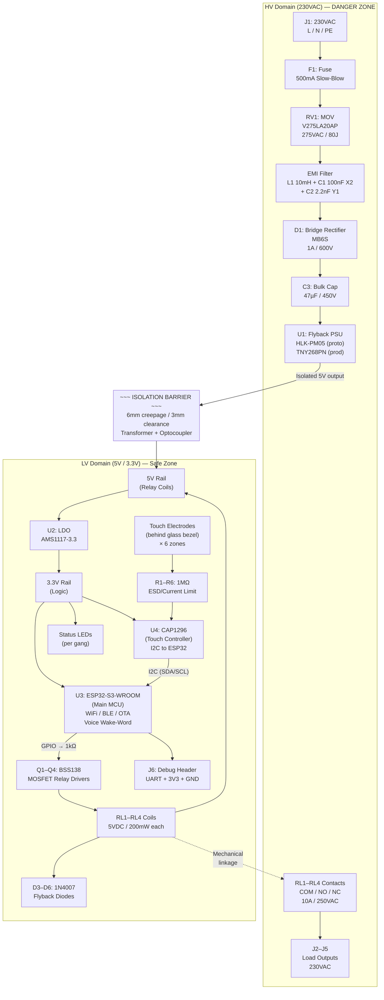

# SETU — Hardware Implementation Draft

*Premium IoT Smart Switch Board | Circuit Architecture & Component Selection*
*Version: 0.1 Draft | Date: May 2026 | Status: Pre-Schematic*

---

## 1. System Architecture Overview

The SETU board operates from 230VAC mains and must cleanly separate three functional domains:

| Domain | Voltage | Isolation | Risk Level |
|--------|---------|-----------|-----------|
| **HV Power Stage** | 230VAC / 325V DC bus | HV side | Lethal |
| **Load Switching Stage** | 230VAC (relay contacts) | HV side | Lethal |
| **Logic Stage** | 3.3V / 5V DC | LV side (isolated) | Safe |

**Isolation barrier** sits between HV and LV domains. No direct electrical path exists across this barrier. Communication crosses it only via optocouplers or transformer coupling.

```
┌──────────────────────────────────────────────────────────────────┐
│  HV DOMAIN (230VAC)            │  LV DOMAIN (3.3V / 5V)         │
│                                 ║ ← ISOLATION BARRIER            │
│  Surge → Fuse → EMI Filter     ║  Touch IC (CAP1296)            │
│  → Rectifier → Bulk Cap        ║  MCU (ESP32-S3)                │
│  → Flyback TX Primary          ║  LED drivers                   │
│                                 ║  WiFi antenna                  │
│  Relay Contacts (COM/NO/NC)    ║  5V relay coil driver          │
│  ← driven via optocoupler ←    ║                                │
└──────────────────────────────────────────────────────────────────┘
```

---

## 2. Power Stage Architecture (Stage-by-Stage)

### Stage 1 — Input Protection & Filtering

**Goal:** Protect against Indian mains surges, line noise, and short circuits before any circuit element is stressed.

```
L (Line) ──→ [F1: Fuse] ──→ [RV1: MOV] ──→ [L1/C1/C2: EMI Filter] ──→ Rectifier
N (Neutral) ─────────────────────────────────────────────────────────→ Rectifier
```

| Ref | Function | Critical Spec (India) |
|-----|---------|----------------------|
| **F1** | Slow-blow fuse | 500mA/250VAC (PSU rail only) |
| **RV1** | Metal Oxide Varistor (MOV) | 275VAC continuous, ≥80J surge energy |
| **F2** | Load-side fuse per relay | 10A/250VAC (one per load circuit) |
| **C1** | X2 capacitor (differential EMI) | 100nF/275VAC X2-rated |
| **C2** | Y1 capacitor (common-mode EMI) | 2.2nF/250VAC Y1-rated |
| **L1** | Common-mode choke | 10mH, 500mA |

> **India-specific:** MOV must be rated 275VAC (not 250VAC). India's voltage can spike to 270V+. A 250VAC MOV will degrade or fail under sustained overvoltage.

### Stage 2 — Rectification & Bulk Storage

```
[EMI Filter] ──→ [D1: Full Bridge] ──→ [C3: 47µF/450V] ──→ ~300–325V DC bus
```

| Ref | Component | Spec |
|-----|---------|------|
| **D1** | Bridge rectifier | MB6S (1A/600V, SMA package, compact) |
| **C3** | Bulk electrolytic cap | 47µF/450V, 105°C, low-ESR |

> **Why 450V cap?** Rectified 270VAC peaks at 382V. 400V caps are undersized. Always use 450V for Indian mains.

### Stage 3 — Isolated Flyback DC-DC Converter

**Why flyback vs. capacitive dropper?**

| Method | Safety | Cost | Size | Verdict |
|--------|--------|------|------|---------|
| Capacitive dropper | ✗ No isolation, lethal | Very low | Tiny | Not acceptable for consumer product |
| Non-isolated buck | ✗ No isolation | Low | Small | Reject |
| **Isolated flyback** | ✓ Full galvanic isolation | Medium | Medium | **USE THIS** |
| Linear transformer | ✓ Isolation | High (heavy) | Large | Too big for panel |

**For Phase 1 Prototype:** Use **HLK-PM05** encapsulated module (Hi-Link). Pre-certified, plug-and-play, 5V/900mA. Eliminates flyback design risk in early prototyping.

**For Phase 3 Production:** Replace with custom flyback using **TNY268PN** (Power Integrations). Lower cost at volume, smaller PCB area, tuned for <2W quiescent.

```
DC Bus (325V) ──→ [U1: TNY268PN] ──→ [T1: Flyback Transformer] 
                                          │
                         Primary side     │   Secondary side (isolated)
                                          │
                                    [D2: Schottky] ──→ [C4: 1000µF/10V] ──→ 5V Rail
                                    [U_FB: PC817 optocoupler feedback]
```

**Transformer spec (T1):**
- Primary: 230VAC → Drain voltage ~700V peak (with leakage spike)
- Secondary: 5V, 500mA (2.5W)
- Isolation: 3kV primary-secondary
- Core: EE13 or EE16 ferrite
- Use TDK/Würth off-the-shelf design or custom wound via CM

### Stage 4 — 3.3V Logic Rail

```
5V Rail ──→ [U2: AMS1117-3.3] ──→ [C5: 10µF] ──→ 3.3V Rail (logic, touch IC, ESP32)
```

| Ref | Component | Note |
|-----|---------|------|
| **U2** | AMS1117-3.3 (AMS) | 800mA LDO. Simple, widely available. |
| **C5** | 10µF ceramic (output) | Required for LDO stability |
| **C6** | 100nF ceramic (bypass) | Close to each IC power pin |

> For lower dropout and better thermal at high ambient (India's 45°C+), consider **NCP1117ST33T3G** (Onsemi) or **MIC5233-3.3YM5-TR** (Microchip).

---

## 3. Logic Stage Architecture

### 3.1 Main MCU — ESP32-S3

**Selection:** **ESP32-S3-WROOM-1-N8R8** (Espressif Systems)

| Parameter | Value |
|-----------|-------|
| CPU | Xtensa LX7 dual-core, 240MHz |
| RAM | 512KB SRAM + 8MB PSRAM (for TFLite voice model) |
| Flash | 8MB on-module |
| WiFi | 802.11 b/g/n 2.4GHz |
| BLE | BLE 5.0 |
| GPIO | 45 usable |
| ADC | 12-bit, 20 channels |
| Peripherals | SPI, I2C, UART, I2S, USB |
| OTA | Native support via ESP-IDF |
| AI accelerator | Vector instructions for TFLite wake-word |
| Package | SMD module, 18mm × 25.5mm |

**Alternative:** **ESP32-S3-MINI-1-N8** (Espressif) — smaller footprint (15.4mm × 20.5mm), 8MB flash, no external PSRAM (sufficient if voice model stays small).

### 3.2 Touch Controller — CAP1296

**Selection:** **CAP1296-1-SN** (Microchip Technology)

| Parameter | Value |
|-----------|-------|
| Channels | 6 capacitive touch inputs |
| Interface | I2C (up to 400kHz) / SMBus |
| Supply | 1.8V–3.6V |
| Sensitivity | Programmable per-channel threshold |
| Noise immunity | Built-in noise filtering for 50Hz/60Hz |
| Package | 20-VQFN (3mm × 3mm) |
| Key feature | Active shielding output (CS_SHLD) to reduce false triggers in high-EMI |

**Why CAP1296 over STM32 built-in TSC?**
- STM32 TSC requires careful PCB layout; performance in high-EMI (230VAC box) is less predictable
- CAP1296 has dedicated silicon for touch sensing with proven EMI rejection
- If 6 channels aren't enough (e.g., 8-gang future variant), use **CAP1298** (8-channel drop-in)

**Touch Electrode Interface:**
```
Touch Pad (behind glass) ──→ [R_S: 1MΩ series resistor] ──→ CAP1296 CS1..CS6 pin
                                (limits current from ESD/HV transients)
CAP1296 CS_SHLD ──→ ground plane guard ring around touch traces
```

**Alternative Touch IC:** **IQS7222C** (Azoteq) — more advanced, ProxFusion technology, 10 channels, but requires more firmware setup. Use if CAP1296 cannot meet sensitivity spec in real enclosure testing.

### 3.3 Load Switching Stage — Relay Array

**Selection:** **G5Q-14-DC5** (Omron) × 4 (one per gang)

| Parameter | Value |
|-----------|-------|
| Coil voltage | 5VDC |
| Contact rating | 10A / 250VAC (resistive) |
| Contact type | SPDT (COM, NO, NC) |
| Mechanical life | 10M operations |
| Electrical life | 100K operations at rated load |
| Coil power | 200mW |
| Package | Through-hole DIP |

**Alternative Relay:** **SRD-05VDC-SL-C** (Songle) — lower cost, widely available, but shorter lifetime. Use only for cost-optimized Phase 4 variant.

**Alternative (silent switching):** **BT136-600E** Triac (NXP) + **MOC3021** optocoupler — no mechanical click, zero-cross switching. For Phase 2+ premium variant.

**Relay Driver Circuit:**
```
ESP32 GPIO (3.3V) ──→ [R_B: 1kΩ] ──→ [Q1: BSS138 N-MOSFET gate]
                                        Q1 Drain ──→ Relay Coil (5V) ──→ +5V
                                        Q1 Source ──→ GND
                                        [D3: 1N4007 flyback diode across coil]
```

> **Why MOSFET instead of BJT?** BSS138 requires no base current — direct drive from ESP32 GPIO. Less component count.

> **Why not direct optocoupler between HV and LV for relay?** The relay coil sits on the LV 5V rail — it's already on the safe side. The relay CONTACTS are HV, but they are mechanically isolated from the coil. This is the correct architecture.

---

## 4. Isolation Strategy

This is the most safety-critical aspect of the design.

### 4.1 Power Isolation
The flyback transformer provides **galvanic isolation** between 230VAC and 5V/3.3V rails. No direct electrical path exists. The feedback loop uses PC817 optocoupler (isolation: 5kV peak).

### 4.2 Touch Electrode Isolation
The touch pads are on the LV (logic) side. A glass or PMMA bezel physically separates user fingers from the PCB. The series 1MΩ resistors on each touch trace limit current to <0.23mA even in worst-case 230V transient contact (230V / 1MΩ = 0.23mA — below 1mA sensation threshold).

### 4.3 Creepage & Clearance (BIS IS 1293)
PCB layout must enforce:

| Measurement | Minimum (IS 1293 / IEC 60950) |
|-------------|-------------------------------|
| Creepage (HV to LV, across surface) | **6mm** (Pollution Degree 2, 230V) |
| Clearance (HV to LV, through air) | **3mm** |
| Creepage (HV trace to board edge) | **4mm** |
| Mains to accessible metal | **8mm** (Basic + additional insulation) |

**Implementation:** Use a PCB slot (routed groove) between HV and LV zones to increase creepage distance without increasing board area.

### 4.4 Feedback Isolation
```
LV side: TL431 shunt reg + PC817 optocoupler LED
HV side: PC817 optocoupler phototransistor → TNY268PN feedback pin
```

---

## 5. Component Selection Table

### 5.1 Active Components

| Ref | Description | Principal MPN | Principal Mfr | Drop-in Alternative | Alt Mfr | Notes |
|-----|-----------|-------------|-------------|-------------------|---------|-------|
| **U1** | Flyback controller (production) | TNY268PN | Power Integrations | VIPer22ADIP-E | STMicroelectronics | Phase 3+; use HLK-PM05 module for Phase 1 |
| **U_MOD** | Encapsulated AC-DC module (proto) | HLK-PM05 | Hi-Link | RAC05-05SK/277 | RECOM | Phase 1 only. Remove in Phase 3 |
| **U2** | 3.3V LDO regulator | AMS1117-3.3 | AMS | NCP1117ST33T3G | Onsemi | 800mA, SOT-223 |
| **U3** | Main MCU (WiFi + Voice) | ESP32-S3-WROOM-1-N8R8 | Espressif | ESP32-S3-MINI-1-N8 | Espressif | 8MB flash + 8MB PSRAM |
| **U4** | Capacitive touch controller | CAP1296-1-SN | Microchip | IQS7222C-000-EXR | Azoteq | 6-channel, I2C |
| **U5–U8** | Relay driver optocoupler (if used) | PC817C | Sharp | EL817C | Everlight | Only if adding extra isolation layer for relay drive |
| **U9** | Flyback feedback optocoupler | PC817A | Sharp | TLP185(F) | Toshiba | CTR: 80–160% |
| **Q1–Q4** | Relay drive MOSFET | BSS138LT3G | Onsemi | 2N7002ET3G | Onsemi | N-ch, SOT-23, 200mA Vgs(th) |
| **D1** | Bridge rectifier | MB6S | Vishay | DF06M | Diodes Inc | 1A/600V, SMA |
| **D2** | Flyback output Schottky | SR540 | Vishay | SS54 | Onsemi | 5A/40V, SMA |
| **D3–D6** | Relay flyback diode | 1N4007 | Vishay | 1N4007G | Onsemi | DO-41, one per relay |
| **RL1–RL4** | 5VDC relay, SPDT, 10A/250VAC | G5Q-14-DC5 | Omron | SRD-05VDC-SL-C | Songle | One per load circuit |

### 5.2 Passive Components — Protection

| Ref | Description | Principal MPN | Mfr | Spec |
|-----|-----------|-------------|-----|------|
| **RV1** | MOV surge suppressor | V275LA20AP | Littelfuse | 275VAC, 80J, 20mm disc |
| **F1** | PSU slow-blow fuse | 0251.500MXL | Littelfuse | 500mA/250VAC, 5×20mm |
| **F2–F5** | Load circuit fuse (per relay) | 0251010.MXL | Littelfuse | 10A/250VAC, one per gang |
| **C1** | X2 differential EMI cap | B32922C3104M | TDK | 100nF/275VAC X2 |
| **C2** | Y1 common-mode cap | B81122C1222M | TDK | 2.2nF/250VAC Y1, Class X1/Y1 |
| **L1** | Common-mode choke | B82721A2102N | TDK | 10mH/500mA |
| **TVS1** | 3.3V rail TVS | SMBJ3V3A | Vishay | Unidirectional, SMB package |

### 5.3 Passive Components — Power Rail

| Ref | Description | Value | Spec | Package |
|-----|-----------|-------|------|---------|
| **C3** | Bulk storage cap | 47µF | 450V, 105°C, electrolytic | 12.5mm radial |
| **C4** | PSU output filter | 1000µF | 10V, 105°C, low-ESR | 8mm radial |
| **C5** | LDO output cap | 10µF | 10V, X5R ceramic | 0805 |
| **C6–Cx** | Bypass cap (per IC) | 100nF | 10V, X7R ceramic | 0402 |
| **R1–R6** | Touch series resistors | 1MΩ | 1%, 0.1W | 0402 |
| **R7–R10** | Relay gate resistor | 1kΩ | 5%, 0.1W | 0402 |

### 5.4 Connectors & Mechanical

| Ref | Description | MPN | Mfr | Note |
|-----|-----------|-----|-----|------|
| **J1** | Mains input connector (L/N/PE) | 691311000003 | Würth | 5mm pitch, 3-pin, screw terminal |
| **J2–J5** | Load output connectors (per gang) | 691311000002 | Würth | 5mm pitch, 2-pin per load |
| **J6** | Programming/debug header | 22-28-4040 | Molex | 4-pin, 2.54mm (UART TX/RX/GND/3V3) |
| **J7** | I2C expansion header | 22-28-4030 | Molex | 3-pin (SDA/SCL/GND) for future sensors |
| **FB1** | Ferrite bead (USB data line) | BLM21PG300SN1D | Murata | 30Ω @ 100MHz, 0805 |

---

## 6. Schematic Block Diagram (Mermaid.js)



---

## 7. Pin Allocation Table — ESP32-S3

| GPIO | Function | Direction | Connected To | Notes |
|------|---------|-----------|-------------|-------|
| GPIO 0 | Boot mode | In | Pull-up (10kΩ) | Low = boot mode |
| GPIO 1 | UART0 TX | Out | J6 debug header | Programming |
| GPIO 2 | UART0 RX | In | J6 debug header | Programming |
| GPIO 3 | I2C SDA | Bi | U4 CAP1296 SDA | Touch IC |
| GPIO 4 | I2C SCL | Out | U4 CAP1296 SCL | Touch IC |
| GPIO 5 | CAP1296 ALERT | In | U4 INT pin | Active-low interrupt |
| GPIO 6 | CAP1296 RESET | Out | U4 RST pin | Active-low reset |
| GPIO 7 | Relay 1 drive | Out | Q1 gate via 1kΩ | Gang 1 |
| GPIO 8 | Relay 2 drive | Out | Q2 gate via 1kΩ | Gang 2 |
| GPIO 9 | Relay 3 drive | Out | Q3 gate via 1kΩ | Gang 3 |
| GPIO 10 | Relay 4 drive | Out | Q4 gate via 1kΩ | Gang 4 |
| GPIO 11 | LED 1 (status) | Out | LED1 anode via 100Ω | Gang 1 indicator |
| GPIO 12 | LED 2 (status) | Out | LED2 anode via 100Ω | Gang 2 indicator |
| GPIO 13 | LED 3 (status) | Out | LED3 anode via 100Ω | Gang 3 indicator |
| GPIO 14 | LED 4 (status) | Out | LED4 anode via 100Ω | Gang 4 indicator |
| GPIO 15 | WiFi status LED | Out | LED5 anode via 100Ω | WiFi connected indicator |
| GPIO 16 | I2S DATA (voice) | In | MEMS mic (future) | Phase 2+ |
| GPIO 17 | I2S CLK (voice) | Out | MEMS mic (future) | Phase 2+ |
| GPIO 18 | I2S WS (voice) | Out | MEMS mic (future) | Phase 2+ |
| GPIO 45 | USB D+ | Bi | USB connector (future) | Phase 2+ |
| GPIO 46 | USB D- | Bi | USB connector (future) | Phase 2+ |
| EN | Enable/Reset | In | RC reset circuit + button | |
| 3V3 | Power | In | U2 LDO output | Decouple: 10µF + 100nF |
| GND | Ground | — | Common LV GND | Isolated from HV GND |

---

## 8. Advanced BOM — Phase 1 Prototype

*Cost estimates at 10-unit prototype quantity (India sourcing: Mouser/DigiKey India or local distributors)*

| Ref | Description | Principal MPN | Unit Cost (₹) | Alt MPN | Alt Cost (₹) | Qty | Extended (₹) |
|-----|-----------|-------------|-------------|---------|------------|-----|------------|
| U_MOD | Hi-Link AC-DC module 5V | HLK-PM05 | 200 | RAC05-05SK/277 | 650 | 1 | 200 |
| U2 | LDO 3.3V | AMS1117-3.3 | 12 | NCP1117ST33T3G | 18 | 1 | 12 |
| U3 | ESP32-S3-WROOM module | ESP32-S3-WROOM-1-N8R8 | 450 | ESP32-S3-MINI-1-N8 | 350 | 1 | 450 |
| U4 | Touch IC CAP1296 | CAP1296-1-SN | 180 | AT42QT1070-MMUR | 90 | 1 | 180 |
| RL1–RL4 | Relay 5VDC SPDT 10A | G5Q-14-DC5 | 85 | SRD-05VDC-SL-C | 25 | 4 | 340 |
| Q1–Q4 | N-MOSFET BSS138 | BSS138LT3G | 8 | 2N7002ET3G | 6 | 4 | 32 |
| D1 | Bridge rectifier MB6S | MB6S-13-F | 15 | DF06M | 12 | 1 | 15 |
| D2 | Schottky SR540 | SR540-13-F | 12 | SS54 | 10 | 1 | 12 |
| D3–D6 | Signal diode 1N4007 | 1N4007-E3/54 | 3 | 1N4007G | 2 | 4 | 12 |
| RV1 | MOV 275VAC | V275LA20AP | 35 | SIOV-S20K275 | 30 | 1 | 35 |
| F1 | Fuse 500mA slow-blow | 0251.500MXL | 20 | 5×20mm 500mA | 8 | 1 | 20 |
| F2–F5 | Fuse 10A 250VAC | 0251010.MXL | 20 | 5×20mm 10A | 8 | 4 | 80 |
| C1 | X2 cap 100nF/275VAC | B32922C3104M | 25 | MKP1841210254 | 22 | 1 | 25 |
| C2 | Y1 cap 2.2nF/250VAC | B81122C1222M | 40 | DE1E3KX222MA4B | 35 | 1 | 40 |
| L1 | CM choke 10mH | B82721A2102N | 45 | DLW32MH101XK2L | 50 | 1 | 45 |
| C3 | Bulk cap 47µF/450V | EEU-FM2W470 | 30 | 860020475014 | 28 | 1 | 30 |
| C4 | Output cap 1000µF/10V | UKW1A102MPD | 18 | 860020375010 | 16 | 1 | 18 |
| C5 | LDO output 10µF | GRM21BR61A106KE18L | 5 | C2012X5R1A106M | 5 | 1 | 5 |
| C_bypass | Bypass cap 100nF (×20) | GCM155R71C104JA55D | 1 | C0402C104K8RAC | 1 | 20 | 20 |
| R1–R6 | Touch series 1MΩ | CRGCQ0402F1M0 | 1 | RC0402FR-071ML | 1 | 6 | 6 |
| R7–R10 | Gate resistor 1kΩ | CRGCQ0402F1K0 | 1 | RC0402FR-071KL | 1 | 4 | 4 |
| J1 | Mains input 3-pin | 691311000003 | 35 | 1729018 | 30 | 1 | 35 |
| J2–J5 | Load output 2-pin (×4) | 691311000002 | 25 | 1729017 | 20 | 4 | 100 |
| J6 | Debug header 4-pin | 22-28-4040 | 12 | TSW-104-07-G-S | 10 | 1 | 12 |
| PCB | 4-layer PCB 140×100mm | — | 800 | — | — | 1 | 800 |
| **TOTAL** | | | | | | | **~2,528** |

> **Note:** At 100-unit quantity, expect 30–40% cost reduction. Target COGS ₹3,500–4,000 including enclosure, assembly, and packaging.

---

## 9. Critical Design Rules Checklist

Before sending to PCB layout:

### Power Stage
- [ ] MOV RV1 placed as close as possible to J1 connector (shortest path to clamp surge)
- [ ] Fuse F1 is the FIRST element after the input connector — nothing before it
- [ ] X2/Y1 caps and CM choke placed between fuse and rectifier
- [ ] Bulk cap C3 rated 450V minimum (NOT 400V)
- [ ] HLK-PM05 module has 8mm clearance on all sides from other components

### Isolation
- [ ] 6mm creepage between any HV trace and any LV trace (measure along PCB surface, including through slotted routing grooves)
- [ ] 3mm clearance (straight-line air gap) HV to LV
- [ ] PCB slot routed between HV island and LV island
- [ ] Transformer T1 bridging the slot — only element allowed to cross isolation boundary
- [ ] No silkscreen, solder mask, or copper on HV side within 1mm of the isolation slot

### Touch Electrode PCB Layout
- [ ] Touch traces are on a dedicated inner layer (signal routing only, no power)
- [ ] Guard ring (CS_SHLD signal from CAP1296) surrounds each touch trace on same layer
- [ ] 1MΩ series resistors placed at CAP1296 pins (not at touch pad end)
- [ ] Touch traces are NOT routed near relay coil traces or WiFi antenna
- [ ] Minimum 5mm separation between touch traces and any HV copper

### WiFi Antenna
- [ ] 15mm copper-free keepout zone on all layers below ESP32-S3 module antenna
- [ ] Module antenna points away from relays (toward board edge)
- [ ] No copper pours, vias, or traces in keepout zone

### Thermal
- [ ] Relay RL1–RL4: verify PCB copper area for thermal dissipation (relay body = 200mW × 4 = 800mW when all energised)
- [ ] LDO U2: with 3.3V output at 200mA load, dropout ≈ 1.7V × 200mA = 340mW → SOT-223 package with thermal via stitching to copper pour

---

## 10. Toolchain Recommendations

### 10.1 ECAD (Schematic & PCB)

| Tool | Purpose | Recommendation | Cost |
|------|---------|---------------|------|
| **KiCad 7.x** | Schematic + PCB layout | **Primary — use this** | Free |
| Altium Designer | Schematic + PCB | Industry standard, great for team collaboration | ₹1.2L/yr |
| EasyEDA Pro | Cloud-based, JLCPCB integration | Good for quick proto, not for production | Free tier |

**KiCad recommended for SETU because:**
- Free (bootstrap-friendly)
- Git-compatible (text-based file format, diffable)
- Strong community libraries for ESP32-S3, CAP1296, relays
- Can export all manufacturing files (Gerber, ODB++, Pick-and-Place)

### 10.2 Firmware (IDE & Debug)

| Tool | Purpose | Recommendation |
|------|---------|---------------|
| **ESP-IDF v5.x + VS Code** | Primary firmware development | **Use this.** Native ESP32-S3 support, CMake, OTA built-in |
| ESP-IDF Extension (VS Code) | Integrated build/flash/monitor | Install: `espressif.esp-idf-extension` |
| **OpenOCD + JTAG** | Hardware debugging | ESP32-S3 has JTAG via USB-OTG; use `ESP-Prog` dongle |
| **Unity + CMock** | Unit testing firmware | Standard C testing framework, works with ESP-IDF |
| **STM32CubeIDE** | If using STM32L0 for touch | Only if you go STM32 route instead of CAP1296 |
| **Segger J-Link Edu** | Debug probe | ₹4,500; excellent for ESP32 + STM32 |

### 10.3 PLM / BOM Management

| Tool | Purpose | Recommendation |
|------|---------|---------------|
| **Git + CSV BOM** | Version-controlled BOM | Use for Phase 1–2. Simple, free, reviewable |
| **Octopart** | Component search + pricing | Free. Excellent for alternates research |
| **Kitspace BOM** | BOM aggregation | Free, open-source |
| **Arena PLM** | Full PLM for production | Phase 3+. Industry standard. ~$100/user/mo |
| **Odoo MRP** | ERP + inventory + BOM | Open-source option for Phase 3. Free self-hosted |

### 10.4 Simulation & Analysis

| Tool | Purpose |
|------|---------|
| **LTspice XVII** | Free SPICE for power supply simulation (flyback, EMI filter) |
| **KiCad SPICE** | Integrated circuit simulation |
| **ANSYS SIwave** (if budget allows) | PCB-level SI/PI analysis, EMI prediction |
| **OpenEMC** | Open-source EMC pre-compliance simulation |

---

## 11. Missing Items & Next Actions

| Item | Priority | Owner | Timeline |
|------|---------|-------|---------|
| Finalize touch IC selection (CAP1296 vs IQS7222C) — order both eval boards | CRITICAL | HW Eng | Week 1 |
| Order ESP32-S3-DevKitC-1 + CAP1296 eval board | CRITICAL | Founder | Week 1 |
| Build EMI test rig in electrical box mockup | CRITICAL | HW Eng | Month 2 |
| Finalize relay selection (Omron G5Q vs alternative) | High | HW Eng | Month 1 |
| KiCad project setup + symbol/footprint library | High | HW Eng | Month 1 |
| Schematic v0.1 (block-level, no routing) | High | HW Eng | Month 2 |
| Order HLK-PM05 modules for proto power supply | High | Founder | Week 1 |
| Create BOM tracking spreadsheet from Section 8 | Medium | Founder | Week 2 |
| Identify PCB fabrication partner (Pune/Bangalore) for 4-layer quote | Medium | Ops | Month 2 |
| Begin transformer T1 spec for CM design | Medium | HW Eng | Month 3 |

---

## 12. Regulatory Notes

### BIS IS 1293:2002 — Key Requirements
- **Clause 14:** Dielectric strength test — 2000VAC for 1 minute, HV to LV
- **Clause 15:** Leakage current — <0.5mA at 1.1× rated voltage
- **Clause 16:** Grounding — PE connection required if any accessible metal
- **Clause 20:** Temperature rise — no surface >85°C during 4-hour operation

### WPC RF Certification
- ESP32-S3-WROOM module already has WPC certification from Espressif
- File product-level WPC cert as "equipment" using the module cert
- **Do not design custom WiFi antenna** (would invalidate module cert and require full WPC re-test)

### RoHS / REACH
- All components in BOM must be RoHS-compliant (lead-free solder, no restricted substances)
- Request RoHS certificates from all component distributors before Phase 3 production order

---

*Next document: `SETU_Schematic_Review_Checklist.md` (after schematic v0.1 is complete)*
*Reference: [SETU_Project_Structure.md](SETU_Project_Structure.md) — for where to file Gerbers, BOM, and certification docs*
